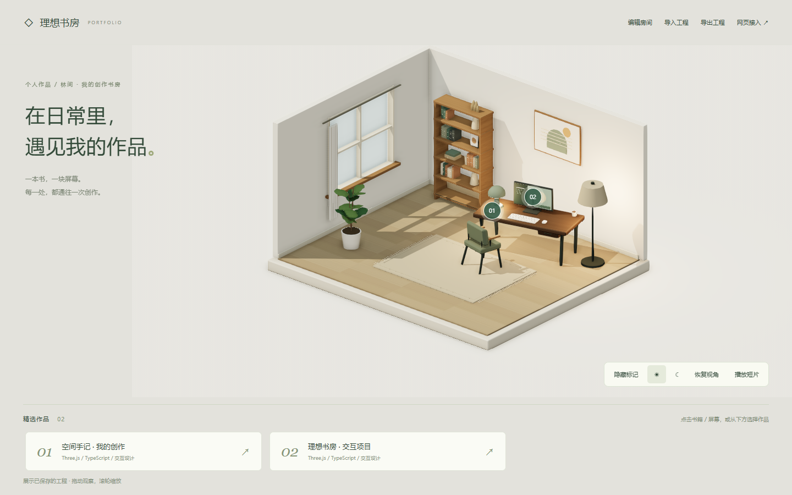

# 理想书房 · 布置、短片与个人作品集

一间可编辑、可拍摄，也可作为个人作品主页的 3D 书房。支持 11 类物件、最多 3 段短片镜头、作品关联、多工程与保存版本，以及图片、视频、模型和独立网站导出。

**当前交付归纳：**[网页入口、工程关系、角色与复用](docs/WEB-CHARACTER-SUMMARY.md)汇总截至功能提交 `129be24` 的成果。角色能力已通过 [PR #2](https://github.com/yydshly/0905_codexgpt6_project/pull/2) → [PR #1](https://github.com/yydshly/0905_codexgpt6_project/pull/1) 合入 `main`。[主干合并记录](docs/MERGE-2026-09-06.md) 记录提交、验证与发布状态。

角色导览默认 28 秒，包含阅读、介绍、坐下阅读并站起。新建示例使用作者提供的鸣人模型，支持自然行走／忍者跑、招手、最多三段时间轴、设置与历史、本地快照、JSON、真实视频和独立网站包；保留青年基础版及个人 IP 设定 01／02 与旧工程。最新修正包括支撑脚约束、起停与重心过渡、连续时间预览及精确暂停恢复。[角色接入与来源](docs/NARUTO-CHARACTER.md) · [步行优化与实际视频](docs/walk-refinement-evidence/README.md) · [个人 IP 02 制作记录](docs/character-ip/EDITION-02.md)。鸣人模型是外部已有角色资产，不属于原创个人 IP；[人物质量升级路线](docs/CHARACTER-QUALITY-ROADMAP.md)中的后续建议不等于已交付功能。

角色导览与人物优化已在 GitHub Pages 上线。[最新加载恢复与配置入口修复](docs/GUIDE-LOADING-RECOVERY.md) · [首次角色发布与真实 HTTPS 验收](docs/RELEASE-2026-09-06.md) · [此前工作台发布](docs/RELEASE-2026-09-05.md)。

[角色切换与快照恢复加固](docs/GUIDE-LOADING-RECOVERY.md)：加载取消／重试、完整角色资源释放、有效存档优先恢复及顶部“配置角色”入口。该记录区分已验证的加载问题与尚未确定原因的浏览器崩溃，并说明角色仍是独立导览配置，尚未统一到房间物件编辑器。

公开入口：[角色导览](https://yydshly.github.io/0905_codexgpt6_project/?workspace=guide) · [我的工程](https://yydshly.github.io/0905_codexgpt6_project/?workspace=projects) · [默认短片](https://yydshly.github.io/0905_codexgpt6_project/) · [作品展示示例](https://yydshly.github.io/0905_codexgpt6_project/?workspace=portfolio)。本机与线上存档分开，带走现有工程请在本机备份 JSON，再在线上导入。

## 启动与入口

Node.js 22.12+，支持 WebGL 2 的桌面浏览器：

```bash
git switch main
npm ci
npm run dev
```

- [我的工程](http://127.0.0.1:5173/?workspace=projects)：管理多套方案、复制、另存为、保存版本与恢复、删除与使用帮助。
- [角色导览](http://127.0.0.1:5173/?workspace=guide)：点击播放体验当前角色的作品导览与坐下 / 站起；左侧可切换角色及移动方式。从作品展示顶部进入会带上当前房间和作品关联，也可导入已有 JSON。
- [布置书房](http://127.0.0.1:5173/?workspace=room)：快速工作区。选中任意家具，在右侧「作品入口」配置作品。管理多套方案请从工程库进入。
- [作品展示示例](http://127.0.0.1:5173/?workspace=portfolio)：直接点击书籍或屏幕、标记或作品列表，打开项目详情。
- [短片工作台](http://127.0.0.1:5173/?workspace=film)：默认入口，已编排 10 秒作品，支持最多 3 段镜头与真实视频导出。
- [网页接入示例](http://127.0.0.1:5173/?workspace=integration)：宿主控制 iframe，接收作品点击事件并展示详情。
- [独立 GLB 查看器](http://127.0.0.1:5173/?workspace=viewer)：打开导出的 GLB 和对应 JSON，继续点击作品入口。

房间与短片顶部均有「3 作品展示」，先保存对应工程再预览。独立房间与已有短片保留各自存档，进入当前短片的房间请用「1 布置书房」。示例展示页不写入个人存档。

```bash
npm run build
npm run preview  # http://127.0.0.1:4173/
npm test         # 真实浏览器验收，包含多工程与版本恢复
npx playwright test tests/projects.spec.ts
npx playwright test tests/publish.spec.ts
npx playwright test tests/portfolio.spec.ts
npx playwright test --config playwright.pages.config.ts tests/portfolio.spec.ts
```

本机测试使用已安装的 Chrome，CI 使用 Chromium。运行时不需要账号、API 密钥或云服务，模型文件随应用提供，不从第三方服务加载模型/字体。不要直接双击 HTML；请使用 HTTP 服务。

## 保存与带走作品

房间 v3、短片 v4、作品配置 v2。多工程保存在 IndexedDB `ideal-study.projects`，每套工程有独立 ID 和可跨刷新恢复的保存版本。原 `ideal-study.plan.v3` 与 `ideal-study.film.v4` 快速存档保留，进入工程库时迁入并去重。逐步撤销栈不跨刷新；保存版本独立保留。详见[工程与版本使用说明](docs/PROJECTS.md)。

**发布个人主页：**布置并关联作品 → 顶部「3 作品展示」→「发布展示页」设置介绍 → 下载网站 ZIP → 解压部署。访客打开即能探索，不依赖作者存档。启动与构建命令自动生成发布模板。详见[使用与部署指南](docs/PUBLISH.md)。

GLB 带走模型、材质和部位标识；JSON 带走房间、照片与作品绑定，短片工程另含镜头数据。配合当前播放器或独立 GLB 适配器接入自己的网页。视频为固定画面，不含可点击物件。

视频导出保留原能力：实际检测 H.264/VP9/VP8，生成 MP4/WebM，无音轨 1280×720、30fps。预览、拖动时间轴和逐帧编码共享镜头数据；真实编码和浏览器解码验证完成后才提供下载。需要 HTTPS 或 localhost/127.0.0.1 安全上下文。

## 文档与实际交付

- [个人 IP 02：实际效果、Blender 源文件、GLB、视频与验收](docs/character-ip/EDITION-02.md)
- [新增网页能力、角色导览和远端交付归纳](docs/WEB-CHARACTER-SUMMARY.md)
- [人物质量升级路线：模型、绑定、动画、控制与渲染（部分推进）](docs/CHARACTER-QUALITY-ROADMAP.md)
- [首次角色发布、线上地址与验证](docs/RELEASE-2026-09-06.md)
- [此前完整工作台发布](docs/RELEASE-2026-09-05.md)
- [工程删除与不保存返回](docs/PROJECT-ACTIONS.md)
- [工程库使用帮助](docs/PROJECTS-HELP.md)
- [多工程管理、版本恢复与限制](docs/PROJECTS.md)
- [多工程实际截图、导出包与验证记录](docs/PROJECTS-VALIDATION.md)
- [通用作品入口、个人网站发布与兼容边界](docs/PUBLISH.md)
- [本轮真实截图、发布 ZIP 与验证记录](docs/PUBLISH-VALIDATION.md)
- [作品配置、接入代码与兼容边界](docs/PORTFOLIO.md)
- [本轮验证、性能和已知限制](docs/PORTFOLIO-VALIDATION.md)
- [实际可导入工程](docs/portfolio-evidence/portfolio-room.json) · [对应 GLB](docs/portfolio-evidence/portfolio-room.glb)
- [原播放器/iframe 接口](docs/REUSE.md) · [资产来源](docs/ASSETS.md) · [第三方许可](THIRD_PARTY_LICENSES.txt)
- 历史记录：[家具与复用验收](docs/REUSE-VALIDATION.md) · [短片验收及视频](docs/FILM-WORKBENCH.md)



当前入口覆盖全部 11 类物件的整体，并保留书籍与屏幕的部位绑定。封面显示在网页详情中；未实现屏幕内操作网站、云同步或自动上传到托管平台。GLB 的独立渲染效果会有差异，未测试其他原生 3D 软件。

以下保留原版的部署说明与历史编辑器记录，历史性能/截图不代替本轮证据。

## GitHub Pages 部署

[发布工作流](.github/workflows/pages.yml)仅支持在 main 上手动触发。它在真实仓库子路径并行执行七组浏览器套件，全部通过后才发布构建产物。普通提交不会自动更新站点。

```bash
npm run build:pages
npm run preview:pages
# http://127.0.0.1:4174/0905_codexgpt6_project/
# 停止预览后，运行完整子路径验收：
npm run test:pages
# 已发布站点的完整 HTTPS 验收：
npm run test:live
```

测试使用独立浏览器上下文，不操作用户现有工程。线上存档仍仅在当前浏览器保存，没有账号或云同步。部署更新不会自动将本机方案传到线上；每套工程可通过 JSON 迁移，历史版本目前不包含在 JSON 中。

本次结果见[发布总结](docs/RELEASE-2026-09-05.md)；[首次上线记录](docs/PAGES.md)保留早期十项测试、原截图与历史测量。

## 常用操作

- 在工程库新建工程，从已布置的书房开始；顶部切换房间、短片、作品展示，同一工程的数据持续保留。
- 房间中左侧添加物件，右侧调整位置、朝向、材质和灯具；选中物件可配置作品入口。观察模式拖动旋转视角，滚轮缩放。
- `Ctrl / ⌘ + S` 保存，`Ctrl / ⌘ + Z` 撤销，`Ctrl / ⌘ + Shift + Z` 重做；保存版本可跨刷新恢复。
- 「我的工程」可保存返回、不保存返回、查看保存版本或另存为。工程卡片可备份和删除；删除永久生效，先备份再确认。
- 工程库顶部「? 使用帮助」提供完整操作说明。

## 源码组织

| 文件 | 职责 |
| --- | --- |
| `src/main.ts` | 工作区入口分流 |
| `src/model.ts` / `src/geometry.ts` / `src/scene.ts` | 场景数据、程序几何、渲染和拾取 |
| `src/room-editor.ts` | 房间编辑、属性、历史和保存 |
| `src/studio.ts` / `src/film-model.ts` / `src/film-export.ts` | 短片工作台、v4 工程与镜头采样、编码和回放 |
| `src/projects.ts` / `src/project-store.ts` / `src/project-menu.ts` | 工程库、IndexedDB 与版本事务、切换和另存为 |
| `src/portfolio-*.ts` / `src/publish-dialog.ts` / `src/site-export.ts` | 作品关联、访客展示、个人网站配置与导出 |
| `src/player.ts` / `src/glb-portfolio.ts` / `src/integration.ts` | 独立播放器、GLB 点击适配和宿主示例 |
| `tests/*.spec.ts` | 10 个文件共 51 项已定义用例，CI 分为七组；各轮实际执行结果见对应验收记录 |

## 已知边界

固定 5.2 × 4.4 m 单房间。没有完整 CAD、复杂物理、账号、多人协作或云同步。手动摆放允许家具相互交叠；台灯/显示器依附书桌，移除书桌会移除其桌面物件，可撤销。

主要支持桌面编辑，窄屏工程库与访客页已有浏览器窗口验证；真实手机 GPU、Safari/Firefox 和大量工程长期负载未验证。没有回收站或整库历史备份；保存失败会明确反馈，重要内容请下载 JSON。

历次成果和测量保留在对应文档，不把旧版本截图当作当前线上结果：[原房间验收](docs/VERIFICATION.md) · [造型优化](docs/REFINEMENT.md) · [编辑体验](docs/USABILITY.md) · [首次上线](docs/PAGES.md)。


## 鸣人动漫角色

`main` 已包含作者提供的鸣人模型，支持自然行走／忍者跑、招呼、阅读、坐下站起，以及同一时间轴的视频和独立网站导出。`npm ci` → `npm run dev` → `http://127.0.0.1:5173/?workspace=guide`。旧角色与旧工程继续保留。模型来源、复用方式与明确限制见 [角色接入说明](docs/NARUTO-CHARACTER.md)；这是 CC BY 标注的已有角色模型，不能视为原创个人 IP。

后续步行修正：连续时间预览、按路程落脚、支撑脚约束、重心和起停过渡；实际运行截图、视频与测量见 [步行优化验收](docs/walk-refinement-evidence/README.md)。
