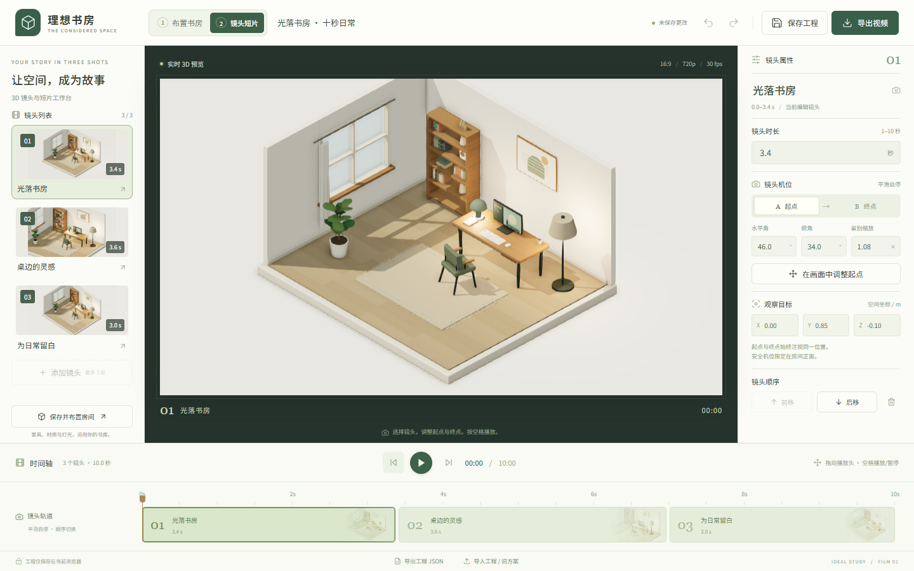

# 理想书房 · 家具、短片与 3D 复用

打开一段已经编排好的十秒日常，再拍出自己的版本。

本次增量：**沙发、床、可上传照片的墙面相框、整屋 / 单件 GLB、独立模型查看器和可由其他网页控制的播放器**。默认保留原书房构图。新数据为房间 v2 / 短片 v3，读取旧存档后保存到新键，保留原数据。

当前分支：[codex/reusable-study](https://github.com/yydshly/0905_codexgpt6_project/tree/codex/reusable-study)，基于 `b360242`；本分支尚未部署。以下原短片交付记录中的 v2 格式仍可迁移打开。

本地可操作入口：[房间](http://127.0.0.1:5173/?workspace=room) · [网页驱动示例](http://127.0.0.1:5173/?workspace=integration) · [GLB 查看器](http://127.0.0.1:5173/?workspace=viewer)。房间的「导出」菜单也提供两个示例入口。

二次开发：[接入指南与代码](docs/REUSE.md) · [本轮验证与限制](docs/REUSE-VALIDATION.md) · [实际整屋 GLB](docs/reuse-evidence/study-room.glb) · [带照片的工程](docs/reuse-evidence/reusable-film.json)。

本分支在原空间布置器上新增 **最多 3 段镜头、起终机位与观察目标、时间轴、播放/暂停/拖动、时长与排序、撤销重做、v2 工程保存恢复，以及真实 MP4/WebM 视频导出**。预览、拖动播放头和逐帧编码使用同一套镜头数据。原八类物件、三种灯光、PNG/JSON 与家具编辑完整保留。

**独立分支：[codex/film-workbench](https://github.com/yydshly/0905_codexgpt6_project/tree/codex/film-workbench)**，从 `790c0ea` 开始；当前 GitHub Pages 仍是 [原空间布置器](https://yydshly.github.io/0905_codexgpt6_project/)，此短片版本尚未合并或部署。请按下方说明在本地打开新工作台。



交付原件：[默认 10 秒 WebM](docs/film-evidence/default-vp9.webm) · [修改后 10.2 秒 MP4](docs/film-evidence/ideal-study-film.mp4) · [对应可编辑工程](docs/film-evidence/verified-film-project.json) · [短片验收与已知限制](docs/FILM-WORKBENCH.md)。GitHub 文件页可通过 **Download raw file** 下载视频。

## 启动

需要 **Node.js 22.12+**（本地验证为 22.15.0），以及支持 WebGL 2 的桌面浏览器。进入本仓库目录后运行：

```bash
git switch codex/reusable-study
npm ci
npm run dev
```

打开 **http://127.0.0.1:5173/**。端口固定且不自动跳号；如端口被占用，先停止已有的同端口服务。

默认入口是短片工作台；`/?workspace=room` 是支持旧方案迁移的 v2 空间布置器。两页顶部都有工作区导航：短片页点击「1 布置书房」，即可编辑当前短片的房间；书房页点击「2 返回短片工作台」，会先保存房间，再返回原镜头工程。绿色标签表示当前位置。保存失败会留在原页提示，不丢弃改动。原左下「保存并布置房间」入口也保留。

视频导出需要安全上下文（HTTPS 或 localhost/127.0.0.1）及浏览器实际支持的 WebCodecs 编码。应用会检测 H.264 / VP9 / VP8，只提供支持的格式。导出固定为无音轨 1280×720、30 fps，逐帧生成，不要求电脑能实时跑到 30 fps。

## 拍摄自己的版本

1. 首次打开自动播放 10 秒作品一次；已保存工程恢复时暂停，系统低动态偏好下也不自动播放。
2. 选择左侧第二个镜头，切换「起点 A / 终点 B」，修改水平角、俯角与景别；点击「在画面中调整」后可拖动/缩放机位。观察目标 X/Y/Z 同时约束该段的起点与终点。
3. 修改时长（每段 1–10 秒）与前移/后移顺序。时间轴同步更新；上方刻度区可拖动播放头，段落本身可选择镜头。时间码为 **秒:帧**。
4. 空格播放/暂停，方向键逐帧定位，Shift + 方向键移动一秒；Ctrl/⌘ + Z 撤销，Ctrl/⌘ + Shift + Z 或 Ctrl + Y 重做。
5. 命名并「保存工程」，刷新恢复；Ctrl/⌘ + S 也可保存。保存仅在当前浏览器，未添加云同步。
6. 「导出视频」→ 选择当前浏览器支持的格式 →「生成视频」→ 在弹窗播放检查 →「下载视频」。生成可取消；真实编码、元数据与首帧解码成功后才提供下载结果。

v2 工程包含原 scene v1 和镜头数据，保存键为 `ideal-study.film.v2`；原 `ideal-study.plan.v1` 存档独立保留。旧 JSON v1 可以导入短片工作台，自动加上默认镜头；首次打开时也可读取已有旧存档。非法文件先校验再处理，不改当前工程或存档。撤销历史保留当前会话最近 80 次编辑，连续机位拖动计一次，刷新不保留历史。

## 本分支验收

入口修复后，本地生产构建 **17/17** 真实浏览器用例通过，其中短片 7 项、原编辑器 10 项。覆盖顶部工作区切换、保存返回、第二镜头修改、保存刷新、工程往返、三种格式编码、文件回放、预览/视频画面比较、旧方案迁移、错误与取消状态。环境、性能、六张实际截图及视频检测报告见 [短片交付记录](docs/FILM-WORKBENCH.md)。GitHub 首次 Chromium 验收为 13/16，三个慢速环境下的问题另行记录，未冒充全平台通过。

```bash
npm test          # 全部 17 项；自动构建、启动 4173 端口并测试
npm run test:film # 7 项短片验收
npm run test:room # 10 项原编辑器回归
```

本地默认使用已安装的 Google Chrome；测试证据在 `test-results/film-evidence/` 与 `test-results/room-evidence/`，交付选片在 `docs/film-evidence/`。GitHub Actions 会在此分支提交时使用 Chromium 执行相同验收，运行记录见 [Actions](https://github.com/yydshly/0905_codexgpt6_project/actions)。

以下为原编辑器的部署、操作和历史验收说明；其旧版线上数据与本次短片本地验证分别记录。

生产构建与本地预览：

```bash
npm run build
npm run preview
```

生产预览地址为 **http://127.0.0.1:4173/**。自动化浏览器验收运行于此生产构建地址。`dist/` 可部署到静态站点托管服务。

安装依赖需要网络；应用运行时不调用云服务、不下载外部模型或字体，不需要 API 密钥。请通过 HTTP 服务访问，不要直接双击 `index.html`。

## GitHub Pages 部署

原版已于 2026-09-05 在用户确认后启用公开站点并完成首次发布，当时十项子路径验收通过。[发布工作流](.github/workflows/pages.yml) 只接受 main 上的手动触发。此短片分支不会自行更新线上版本。

线上地址：[https://yydshly.github.io/0905_codexgpt6_project/](https://yydshly.github.io/0905_codexgpt6_project/)。[首次发布成功记录](https://github.com/yydshly/0905_codexgpt6_project/actions/runs/33944881617)；浏览器线上复验、更新步骤与权限说明见 [发布说明](docs/PAGES.md)。

```bash
npm run build:pages
npm run preview:pages
# 打开 http://127.0.0.1:4174/0905_codexgpt6_project/
```

停止上述预览后运行 `npm run test:pages`，可自动构建、启动并验收 Pages 子路径。构建产物在 `dist-pages/`，原编辑器证据在 `test-results/pages-evidence/`，短片测试文件仍写入 `test-results/film-evidence/`。本次只实际重跑了子路径下的短片完整流程（1/1），完整 16 项在根路径执行。

运行 `npm run test:live` 可在真实线上 HTTPS 地址重跑十项验收，不启动本地服务器。它使用隔离的测试浏览器上下文，证据位于 `test-results/live-evidence/`，不会覆盖用户现有浏览器的存档。

线上地址与本机开发地址的存档不互通；通过 JSON 导出、导入迁移。上线不会增加云同步，也不会上传访问者的方案。

## 原空间布置器的使用

1. 通过 `/?workspace=room` 进入原空间布置器。点击左侧物件缩略图添加物件，新物件会自动选中。
2. 在「布置」模式中，点击场景物件选择并拖动；选中名称悬浮显示，拖动时显示实时坐标。位置吸附到 0.1 m 网格，限制于房间内；台灯和显示器约束在所属书桌上。
3. 右侧顶部可直接切换物件，名称旁可重命名；重复物件自动编号。右侧修改 X/Z 坐标、朝向、材质；灯具支持开关和亮度。书桌移动或旋转时，桌面物件一起跟随。
4. 切换「观察」模式后，左键拖动旋转镜头；两种模式均支持右键观察、滚轮缩放。上方可切换默认、俯视和近景，右下可恢复默认视角。手动旋转或缩放后，视角预设取消高亮；保存和刷新后仍与实际镜头一致。
5. 底部切换白昼、黄昏、深夜，实际改变光源强度、颜色、方向、环境光和窗外颜色。
6. 修改顶部名称，点击「保存方案」。刷新同一地址可恢复。通过「导出」下载 PNG、JSON，或重新导入 JSON 继续编辑。

| 快捷键 | 操作 |
|---|---|
| V / C | 布置 / 观察 |
| 方向键 / Shift + 方向键 | 移动选中物件 0.1 / 0.5 m |
| R | 旋转 15° |
| Delete / Backspace | 移除选中物件 |
| Esc | 取消选择、关闭弹窗或物件库 |
| Ctrl / ⌘ + Z | 撤销 |
| Ctrl / ⌘ + Shift + Z，或 Ctrl + Y | 重做 |
| Ctrl / ⌘ + S | 保存到当前浏览器 |

## 保存与文件

- **本地保存**使用 `localStorage`，仅保存一个当前方案，手动点击保存才会覆盖旧存档。没有账号或云同步。浏览器清理站点数据后，存档可能丢失，建议导出 JSON 备份。
- 本地存储按浏览器、协议、域名和端口隔离。`localhost` 与 `127.0.0.1`，开发端口 `5173` 与预览端口 `4173` 的存档不互通；可用 JSON 文件迁移。
- **PNG**是当前镜头的 2 倍画布分辨率，包含真实 3D 房间，不包含编辑面板和选中标记。
- **JSON v1**包含方案名称、物件、可选物件名称、坐标、朝向、材质、灯光、氛围、镜头和选择状态。最大 2 MB、40 件物件。导入先校验，失败保持当前方案，并在弹窗内说明原因；成功导入可撤销，保存后才写入本地存档。
- 撤销/重做保留最近 80 次编辑；连续拖动或拖动亮度滑杆记为一次。历史在当前会话内有效，刷新后从恢复的方案开始。

## 真实验证与截图

完整记录见 [验收报告](docs/VERIFICATION.md)，包含流程、实际环境、性能、修正记录和未验证边界。第二轮的造型、操作反馈与性能改进见 [优化报告](docs/REFINEMENT.md)；第三轮的物件切换、命名、旧文件兼容及导入保护见 [使用体验优化](docs/USABILITY.md)；本地完整浏览器验收 10/10 通过。

- [白昼默认 · 1440×900](docs/evidence/01-default-1440x900.png)
- [近景 · 1440×900](docs/evidence/02-close-1440x900.png)
- [俯视 · 1280×800](docs/evidence/03-top-1280x800.png)
- [深夜选中与灯光属性 · 1280×800](docs/evidence/04-night-selected-1280x800.png)
- [窄屏物件库抽屉 · 390×844](docs/evidence/05-narrow-library-390x844.png)
- [通过线上产品导出的 PNG](docs/evidence/06-exported-scene.png) / [通过线上产品导出的可编辑 JSON](docs/evidence/live-plan.json)

上述六张图片已更新为 GitHub Pages 线上复验的真实截图和实际导出文件，不是设计稿。第三轮本地性能和流程记录保留原始数据；本次线上数据与截图校验值见 [线上验证记录](docs/evidence/pages-live.json)。

运行浏览器验收（本地默认使用已安装的 Google Chrome）：

```bash
npm test
```

测试会自动构建并启动生产预览。没有安装 Chrome 时，可安装 Playwright Chromium，并把配置中的 `channel` 改为 `chromium`。GitHub Actions 已配置 Chromium 的安装和同一组验收；[查看构建与浏览器记录](https://github.com/yydshly/0905_codexgpt6_project/actions)。

## 源码组织

| 文件 | 职责 |
|---|---|
| `src/model.ts` | 唯一场景数据、默认布局、添加策略、约束、导入校验 |
| `src/geometry.ts` | 家具、建筑与装饰的程序几何，木纹和织物材质 |
| `src/scene.ts` | Three.js 渲染、真实灯光、阴影、SSAO、抗锯齿、拾取、拖动、镜头与 PNG |
| `src/main.ts` / `src/room-editor.ts` | 入口分流 / 保留原产品界面、属性、历史、存档和文件操作 |
| `src/studio.ts` / `src/studio.css` | 镜头工作台、时间轴、编辑历史、工程持久化与视频回放 |
| `src/film-model.ts` | v2 工程、旧版迁移、默认编排与唯一时间采样函数 |
| `src/film-export.ts` | 实际编码能力检测、逐帧 WebCodecs 编码和 MP4/WebM 封装 |
| `src/style.css` | 布局、视觉样式、交互状态与窄屏适配 |
| `tests/study.spec.ts` | 实际浏览器连续操作、文件下载、恢复和回归验收 |

家具与房间模型、画框图形、显示器内容和程序纹理由项目源码生成；没有导入外部家具模型。渲染引擎和图标库为外部开源依赖，详见 [资产来源](docs/ASSETS.md) 与 [第三方许可证](THIRD_PARTY_LICENSES.txt)。

## 第一版边界

固定 5.2 × 4.4 m 单房间。没有完整 CAD、复杂物理、账号、多人协作或云同步。

手动摆放允许家具相互交叠；实现的是房间和桌面约束，不是碰撞求解。台灯/显示器只能放在书桌上，移除书桌会一并移除桌面物件，支持撤销。书籍、键盘、杯子和墙面装饰属于宿主模型细节，不独立编辑。

桌面是本次完整编辑目标。窄屏提供场景观察与物件库抽屉，但手机端完整属性编辑未实现。未验证 Safari、Firefox、触屏设备及长期大负载使用；详情见验收报告。
