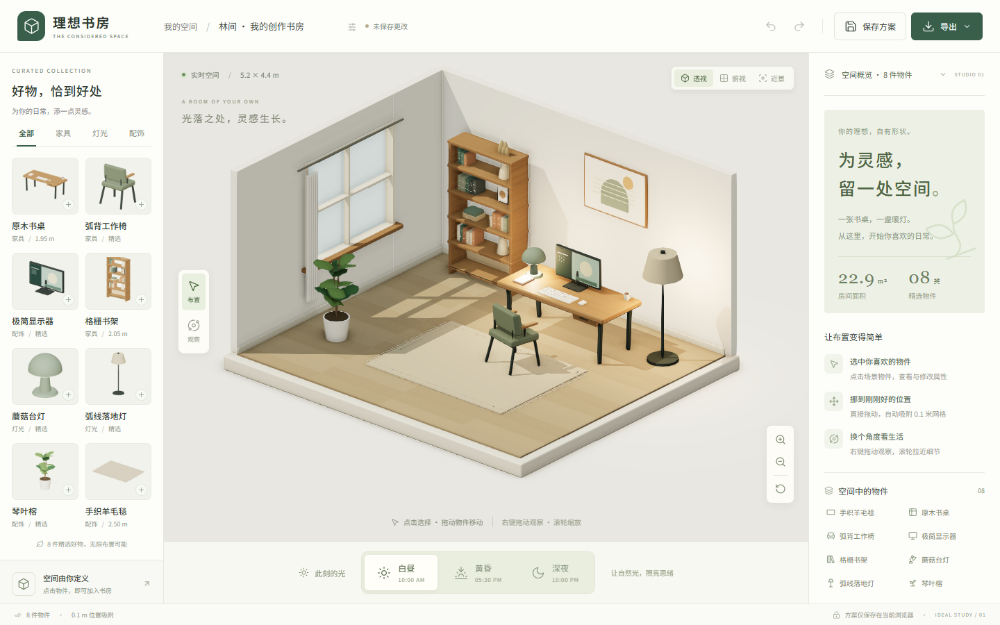

# 理想书房 · 3D 空间布置器

一间已经布置好的书房，一个安放灵感的地方。

**可实际编辑的浏览器端产品**：8 类物件、3 种真实光照、物件与镜头操作、撤销重做、本地保存、PNG 与 JSON 导入导出。默认画面直接来自可编辑的场景数据。



## 启动

需要 **Node.js 22.12+**（本地验证为 22.15.0），以及支持 WebGL 2 的桌面浏览器。进入本仓库目录后运行：

```bash
npm ci
npm run dev
```

打开 **http://127.0.0.1:5173/**。端口固定且不自动跳号；如端口被占用，先停止已有的同端口服务。

生产构建与本地预览：

```bash
npm run build
npm run preview
```

生产预览地址为 **http://127.0.0.1:4173/**。自动化浏览器验收运行于此生产构建地址。`dist/` 可部署到任意静态站点托管服务；本仓库未启用线上托管。

安装依赖需要网络；应用运行时不调用云服务、不下载外部模型或字体，不需要 API 密钥。请通过 HTTP 服务访问，不要直接双击 `index.html`。

## 使用

1. 默认进入「林间 · 我的创作书房」。点击左侧物件缩略图添加物件，新物件会自动选中。
2. 在「布置」模式中，点击场景物件选择并拖动；选中名称悬浮显示，拖动时显示实时坐标。位置吸附到 0.1 m 网格，限制于房间内；台灯和显示器约束在所属书桌上。
3. 右侧顶部可直接切换物件，名称旁可重命名；重复物件自动编号。右侧修改 X/Z 坐标、朝向、材质；灯具支持开关和亮度。书桌移动或旋转时，桌面物件一起跟随。
4. 切换「观察」模式后，左键拖动旋转镜头；两种模式均支持右键观察、滚轮缩放。上方可切换默认、俯视和近景，右下可恢复默认视角。手动旋转或缩放后，视角预设取消高亮；保存和刷新后仍与实际镜头一致。
5. 底部切换白昼、黄昏、深夜，实际改变光源强度、颜色、方向、环境光和窗外颜色。
6. 修改顶部名称，点击「保存方案」。刷新同一地址可恢复。通过「导出」下载 PNG、JSON，或重新导入 JSON 继续编辑。

| 快捷键 | 操作 |
|---|---|
| V / C | 布置 / 观察 |
| 方向键 / Shift + 方向键 | 移动选中物件 0.1 / 0.5 m |
| R | 旋转 15° |
| Delete / Backspace | 移除选中物件 |
| Esc | 取消选择、关闭弹窗或物件库 |
| Ctrl / ⌘ + Z | 撤销 |
| Ctrl / ⌘ + Shift + Z，或 Ctrl + Y | 重做 |
| Ctrl / ⌘ + S | 保存到当前浏览器 |

## 保存与文件

- **本地保存**使用 `localStorage`，仅保存一个当前方案，手动点击保存才会覆盖旧存档。没有账号或云同步。浏览器清理站点数据后，存档可能丢失，建议导出 JSON 备份。
- 本地存储按浏览器、协议、域名和端口隔离。`localhost` 与 `127.0.0.1`，开发端口 `5173` 与预览端口 `4173` 的存档不互通；可用 JSON 文件迁移。
- **PNG**是当前镜头的 2 倍画布分辨率，包含真实 3D 房间，不包含编辑面板和选中标记。
- **JSON v1**包含方案名称、物件、可选物件名称、坐标、朝向、材质、灯光、氛围、镜头和选择状态。最大 2 MB、40 件物件。导入先校验，失败保持当前方案，并在弹窗内说明原因；成功导入可撤销，保存后才写入本地存档。
- 撤销/重做保留最近 80 次编辑；连续拖动或拖动亮度滑杆记为一次。历史在当前会话内有效，刷新后从恢复的方案开始。

## 真实验证与截图

完整记录见 [验收报告](docs/VERIFICATION.md)，包含流程、实际环境、性能、修正记录和未验证边界。第二轮的造型、操作反馈与性能改进见 [优化报告](docs/REFINEMENT.md)；第三轮的物件切换、命名、旧文件兼容及导入保护见 [使用体验优化](docs/USABILITY.md)；本地完整浏览器验收 10/10 通过。

- [白昼默认 · 1440×900](docs/evidence/01-default-1440x900.png)
- [近景 · 1440×900](docs/evidence/02-close-1440x900.png)
- [俯视 · 1280×800](docs/evidence/03-top-1280x800.png)
- [深夜选中与灯光属性 · 1280×800](docs/evidence/04-night-selected-1280x800.png)
- [窄屏物件库抽屉 · 390×844](docs/evidence/05-narrow-library-390x844.png)
- [通过产品导出的 PNG](docs/evidence/06-exported-scene.png) / [通过产品导出的可编辑 JSON](docs/evidence/verified-plan.json)

上述均为真实运行截图或由应用实际导出的文件，不是设计稿。

运行浏览器验收（本地默认使用已安装的 Google Chrome）：

```bash
npm test
```

测试会自动构建并启动生产预览。没有安装 Chrome 时，可安装 Playwright Chromium，并把配置中的 `channel` 改为 `chromium`。GitHub Actions 已配置 Chromium 的安装和同一组验收；[查看构建与浏览器记录](https://github.com/yydshly/0905_codexgpt6_project/actions)。

## 源码组织

| 文件 | 职责 |
|---|---|
| `src/model.ts` | 唯一场景数据、默认布局、添加策略、约束、导入校验 |
| `src/geometry.ts` | 家具、建筑与装饰的程序几何，木纹和织物材质 |
| `src/scene.ts` | Three.js 渲染、真实灯光、阴影、SSAO、抗锯齿、拾取、拖动、镜头与 PNG |
| `src/main.ts` | 产品界面、双向属性、历史、本地存档和文件操作 |
| `src/style.css` | 布局、视觉样式、交互状态与窄屏适配 |
| `tests/study.spec.ts` | 实际浏览器连续操作、文件下载、恢复和回归验收 |

家具与房间模型、画框图形、显示器内容和程序纹理由项目源码生成；没有导入外部家具模型。渲染引擎和图标库为外部开源依赖，详见 [资产来源](docs/ASSETS.md) 与 [第三方许可证](THIRD_PARTY_LICENSES.txt)。

## 第一版边界

固定 5.2 × 4.4 m 单房间。没有完整 CAD、复杂物理、账号、多人协作或云同步。

手动摆放允许家具相互交叠；实现的是房间和桌面约束，不是碰撞求解。台灯/显示器只能放在书桌上，移除书桌会一并移除桌面物件，支持撤销。书籍、键盘、杯子和墙面装饰属于宿主模型细节，不独立编辑。

桌面是本次完整编辑目标。窄屏提供场景观察与物件库抽屉，但手机端完整属性编辑未实现。未验证 Safari、Firefox、触屏设备及长期大负载使用；详情见验收报告。
