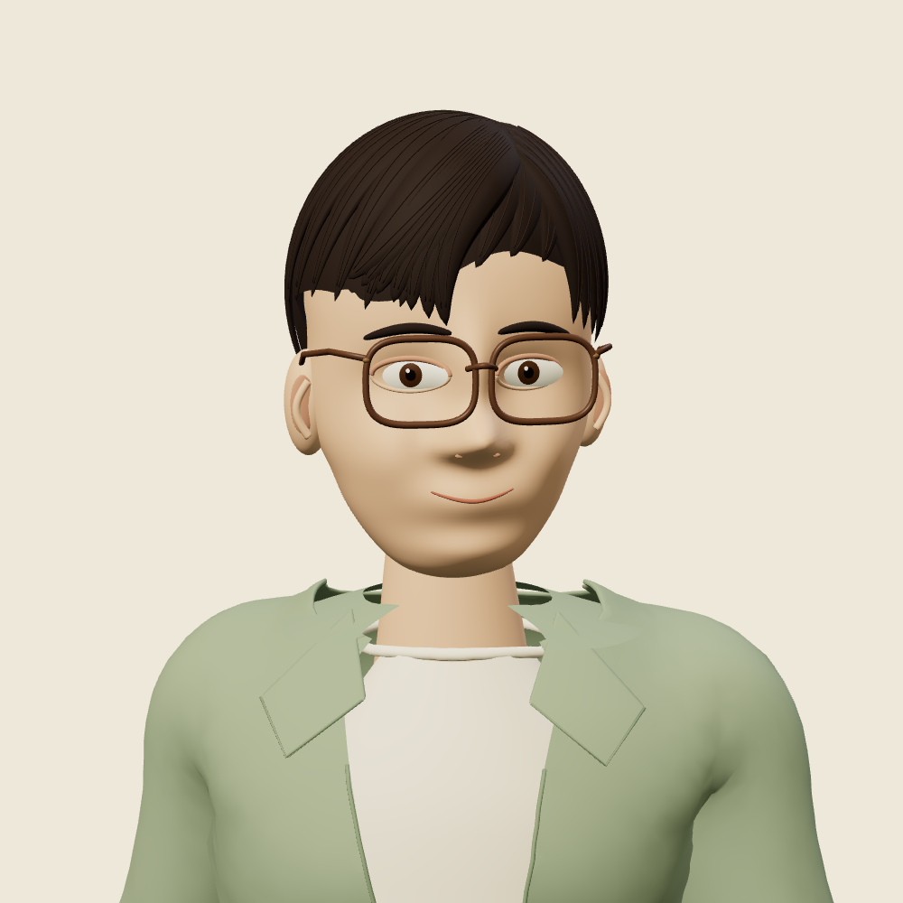
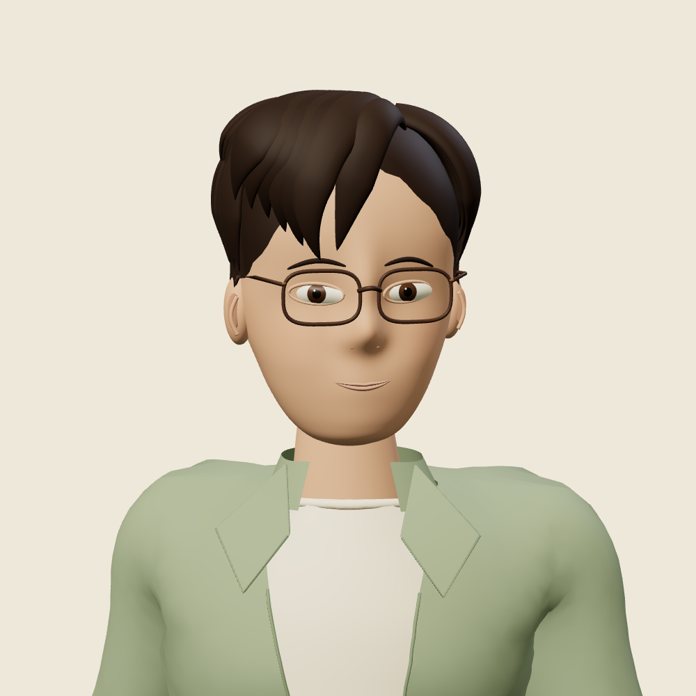
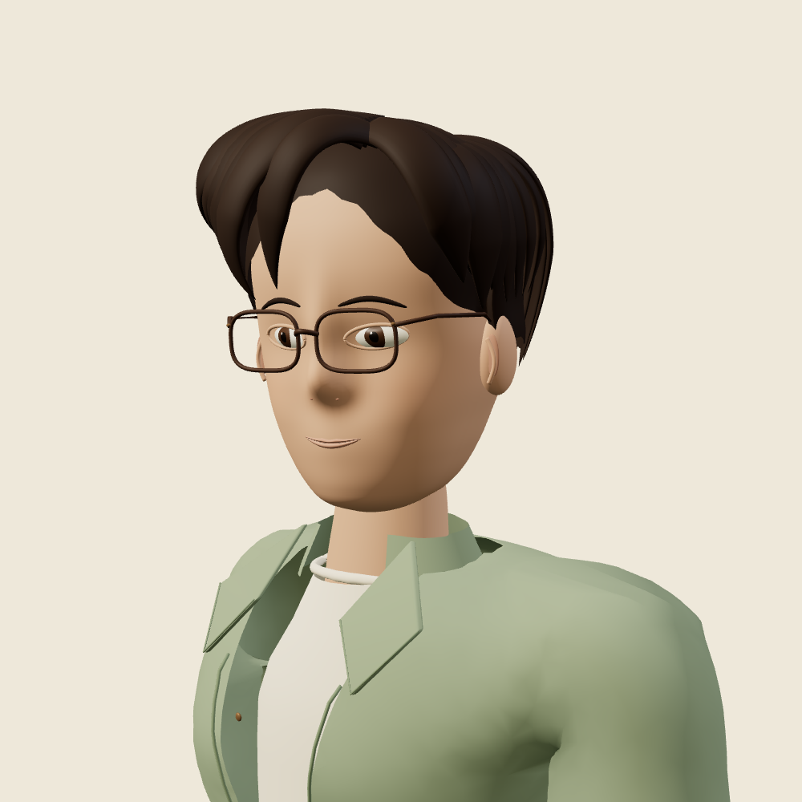
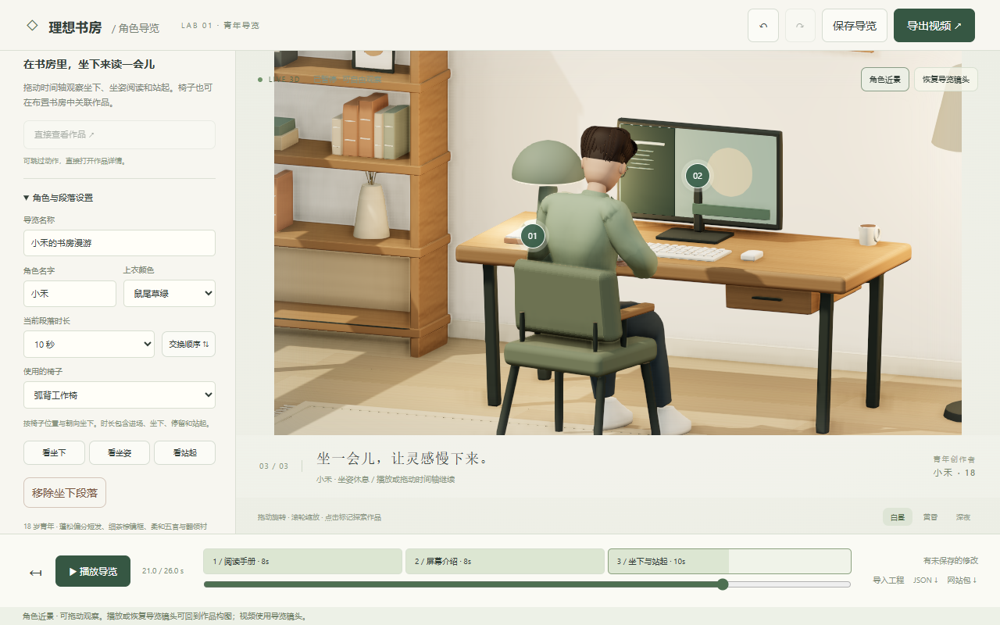

# 个人 IP · 蓬松偏分 02

2026-09-06，`codex/character-guide`。本轮实际制作了新的 Blender 角色资产并接入角色导览。方向为 18 岁成年创作者：深咖偏分短发、细茶棕眼镜、鼠尾草绿开襟衬衫、米白内搭、深灰长裤和陶土色折页标识。名字继续由工程设置，没有使用本人照片。

## 本轮制作与效果

- 发型改为可单独编辑的曲线控制发束，保留刘海、偏分轮廓、鬓角和短后发层次；调整粗糙度，去掉过强的塑料高光。发底按真实头部曲面覆盖，修正侧额及坐姿后脑露出头皮的问题。
- 收细眼镜和眉毛，调整头脸、鼻部、杏仁形眼睛与虹膜比例，增加上下唇曲面。保留眨眼、微笑形变与眼神驱动。
- 皮肤使用几何和顶点颜色，补充脸颊、鼻尖及耳部的轻微暖色变化。没有将概念图或脸部照片贴在平面上。
- 修正原领口与翻领衔接。延续原来的骨骼和人体基础，继续使用行走、阅读、介绍、坐下和站起的现有驱动。

以下是实际 Chrome / Three.js 渲染。独立人物图复用导览里的同一模型加载器和姿态驱动，只更换为中性背景、灯光和检查镜头；书房截图来自完整应用。

| 同灯光、同镜头的旧版 | 本轮 02 |
| --- | --- |
|  |  |





这是一版可编辑、可运行的风格化资产。技术验收不等于个人 IP 美术定稿；与高质量手工雕刻、贴图绘制和定制表演仍有差距，尤其是发束连接、耳部、皮肤层次、衣褶和手部。

## 在项目里使用

```sh
npm ci
npm run dev
# http://127.0.0.1:5173/?workspace=guide
```

新建导览默认使用「个人 IP · 蓬松偏分 02」。已有存档保留原来的角色，在左侧「角色形象」中选择新版，点击「角色近景」检查，再按需保存导览。选择器在左侧上部，若已滚动到设置区请向上滚动。

角色编号为 `personal-creator-02-v1`。外层工程仍为 `ideal-study-guide / version: 1`，角色设置仍为 v4；这次只扩充已登记资产，不改变旧数据语义。01 与基础青年资产原文件未修改。切换、撤销重做、本地保存、JSON、视频和网站包均使用所选编号。

本轮推送开发分支，不代表已合并或部署公开主站。

## 实际交付与复用

| 文件 | 内容与适用范围 |
| --- | --- |
| [personal-creator-02.glb](../../src/assets/guide/personal-creator-02.glb) | 网页可加载的角色；67 骨骼、31 网格、20 材质、待机与行走两段动画、Blink / SoftSmile。7,448,408 bytes |
| [personal-creator-02.blend](source/personal-creator-02.blend) | Blender 4.5.3 源文件；110 个独立网格，可分别调整发束、五官、眼镜及服装。保留骨骼、两段 NLA 动画和文件内使用说明 |
| [制作脚本](../../scripts/build-personal-avatar-v2.py) | 从仓库内 `creator-18.glb` 重新制作，不需外部服务或下载模型；同时生成 GLB 与 Blender 源文件 |
| [坐下站起动作文件](../../src/assets/guide/guide-motion-v1.glb) | 原有独立动作资源，需要匹配骨骼与程序内座椅适配；没有宣称已烘焙进上面的角色 GLB |
| [实际导览视频](../character-02-evidence/xiaohe-guide.mp4) | 本轮角色在书房中的真实导出，可直接作为普通视频接入网页 |
| [独立导览网站 ZIP](../character-02-evidence/xiaohe-guide.website.zip) | 包含当前角色、坐姿动作、运行时和工程配置；解压后通过 HTTP(S) 服务运行或部署到静态托管 |
| [已验证工程 JSON](../character-02-evidence/verified-guide.json) | 可在导览中导入，继续编辑角色、配色与段落 |

单独 GLB 可复用外观、骨骼、待机、行走和表情形变。随身手册、阅读、介绍、导航、坐姿对齐和作品点击是应用运行时代码。要保留完整互动，使用独立网站包或复用 `adult-character.ts`、`guide-model.ts` 及相关运行时；不能只拷贝一个模型文件就获得完整业务。

Blender 源文件打开后默认启用 Idle_Loop。在 NLA 编辑器中每次只启用一个动作轨道查看待机或行走。手工修改应另存版本并登记新的资产编号；生成脚本重建的是脚本中定义的版本，不会读取手工修改后的 `.blend`。

重新制作与检查：

```sh
blender --background --python scripts/build-personal-avatar-v2.py
npm run dev
# 另一个终端，输出真实人物多角度截图：
node scripts/review-personal-avatar.mjs
```

`review-personal-avatar.mjs` 面向本地 Vite 开发服务，不用于构建后站点。默认写入本轮证据目录，使用隔离的浏览器存储。完整闭环验证命令和结果见 [验收记录](../character-02-evidence/VALIDATION.md)。

## 来源与边界

基础人体的手部、袖子和裤装蒙皮拓扑、骨架、基础动画源于 Quaternius CC0，上一轮已做比例和服装修改。本轮头脸、头发、材质和领口的修改由 Blender 脚本制作。原人体建模和原始动画质量属于外部作者，未冒充本项目原创；[完整许可说明](../../THIRD_PARTY_LICENSES.txt)同步包含在网站包中。

概念图来自此前的图像生成，是参考；本轮没有使用图片转 3D 服务、采购、外包或新增费用。角色没有头发/衣服物理、口型驱动、真实折射镜片或定制动捕。新增资产没有改变沙发、床、任意椅子自动适配等既有范围。

源文件已经通过 Blender 后台重新打开检查；没有把 Blender GUI 手工雕刻、其他 3D 引擎运行或未执行的跨设备测试记为已验证。
