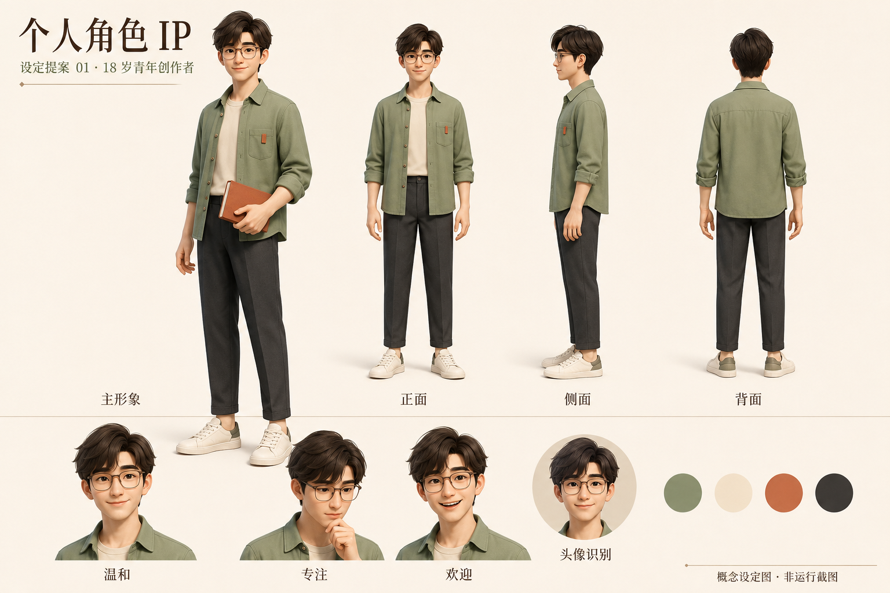

# 个人角色 IP · 设定提案 01

后续进展：用户已确认继续，现有[真实 3D 接入样版与验证记录](INTEGRATION.md)。以下保留概念图交付时的设计说明。

2026-09-06。根据“从零设计专属角色，并在书房、导览、视频和发布网页中统一使用”的需求制作。延续 18 岁成年青年基准。以下外形与气质是设计提案，不是对用户本人外貌或性格的描述，最终角色名称待定。

## 设计方向

温暖、亲和、专注的青年创作者。采用柔和而保持成年特征的脸型，修长自然的人体比例，舒展的肩颈和手部姿态，与现有浅墙、暖木、鼠尾草绿和深色金属书房协调。

固定识别特征建议：

- 深棕蓬松短发，保留不对称的弧形额发轮廓。
- 透明茶棕色圆角方框眼镜，眼睛在近景与头像中清晰可见。
- 鼠尾草绿翻领衬衫、米白内搭、炭灰长裤及米白帆布鞋。
- 胸口口袋的陶土色折页布标，与手持手册呼应，作为小尺度识别元素。
- 表情基准为轻微笑容、专注思考、欢迎介绍；基本姿态放松，避免握拳和紧绷肩颈。

眼镜、穿搭、气质和配色均待用户选择，可以继续修改；没有将它们解释为用户已确定的个人特征。

## 统一应用规则

1. 角色出现在导览、短片、个人展示网页时，共用同一版人物资产和材质设定。
2. 头像、封面等二维素材从同一角色设定延展，保留脸型、发型、眼镜和配色，不分别生成无关联的人物。
3. 表情、动作和灯光可变；身份识别特征保持稳定。服装变体在核心角色确定后另行设计。
4. 本次设定图用于外形评审和后续建模参考。AI 生成的各视图不能视为严格一致的工程三视图，建模前需要统一尺寸、裁片、配饰位置与转身轮廓。

## 后续 3D 实施边界

本轮仅完成角色设计提案。没有生成可编辑的 3D 模型，没有替换当前应用，也没有重新部署站点；现有小禾仍是功能占位。

角色方向确定后，需要制作相符的头脸、头发、眼镜和服装，再适配骨骼、表情、眼神和持书接触。现有导览数据、作品入口、保存、视频和网站包能力可以继续利用，但更换角色资源后必须重新验证比例、动作、同帧导出和独立网站加载，不能仅更换文件名就宣布完成。

## 文件与来源

- `concept-01.png`：内置 image_gen 生成的第一版概念设定图；不是实际应用截图或外部素材站模型。
- [完整提示词及工具记录](concept-01-prompt.md)。
- 当前可运行角色的外部资源来源仍见 [ADULT-AVATAR.md](../ADULT-AVATAR.md)，本次图像提案没有改变其授权或资产归属。

已检查：主要文字、全身视图与表情、服装配色和主要识别特征。图中“概念设定图 · 非运行截图”明确标识其用途。本次没有修改运行代码，因此未重复执行浏览器回归测试。
